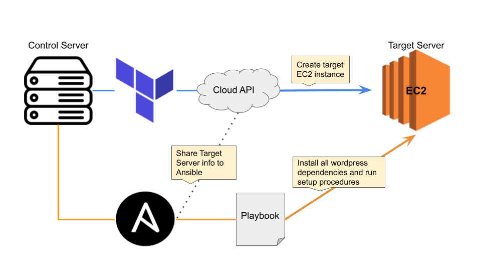
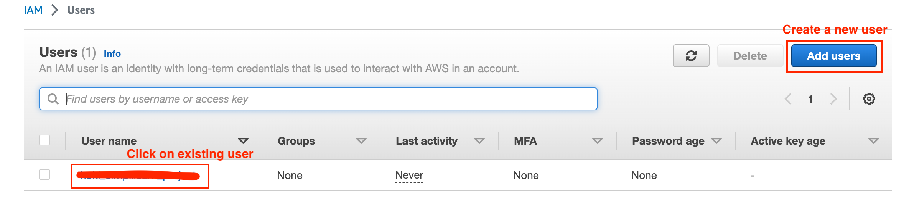
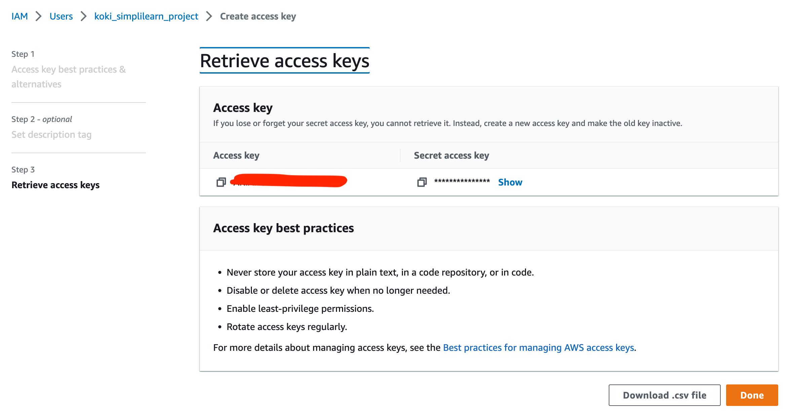
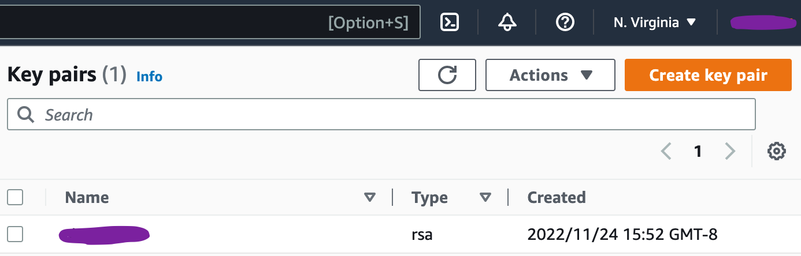
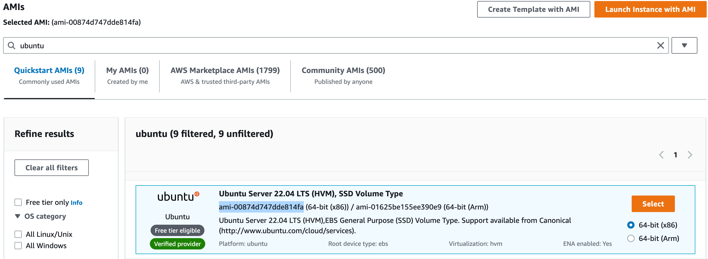
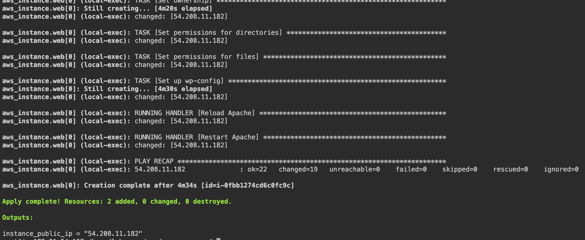
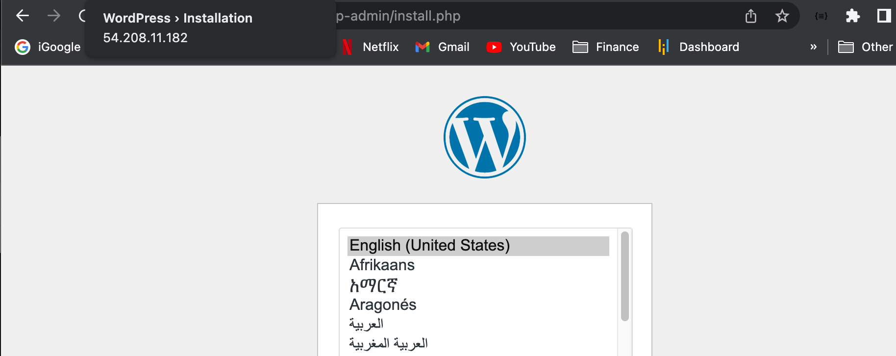

# Deploy WordPress Environment

<p align='center'>
    
</p>

## Project Goal:

Using configuration management tools like Terraform and Ansible, automate setting up wordpress and all of its dependencies. This exercise demonstrates the benefits of DevOps tools by standardizing the installation procedure, making complex manual tasks reproducible and less prone to error, speeding up overall development time.

Required Tools:

1.  AWS (EC2)
2.  Terraform
3.  Ansible

## Steps:

1.  [Install pre-requisite software on host machine](#Install-pre-requisite-software-on-host-machine)
2.  [Set up Terraform to provision target server](#Set-up-Terraform-to-provision-target-server)
3.  [Set up Ansible to install WordPress dependencies on target server](#Set-up-Ansible-to-install-WordPress-dependencies-on-target-server)
4.  [Execute scripts to perform installation](#Execute-scripts-to-perform-installation)
5.  [Validate installation of Wordpress](#Validate-installation-of-Wordpress)

### Install pre-requisite software on host machine

All required files can be easily downloaded by running the `install.sh` bash script included in this repository. Below is a step-by-step process of installing each tool.

1.  Installing Terraform from APT repository

```bash
# Update the system & install software-properties-common
sudo apt-get update && sudo apt-get install -y gnupg software-properties-common

# Download signing key
wget -O- https://apt.releases.hashicorp.com/gpg | \
    gpg --dearmor | \
    sudo tee /usr/share/keyrings/hashicorp-archive-keyring.gpg

# Verify key fingerprint - should match E8A0 32E0 94D8 EB4E A189 D270 DA41 8C88 A321 9F7B
gpg --no-default-keyring \
    --keyring /usr/share/keyrings/hashicorp-archive-keyring.gpg \
    --fingerprint

# Add official Hashicorp repository to system
echo "deb [signed-by=/usr/share/keyrings/hashicorp-archive-keyring.gpg] \
    https://apt.releases.hashicorp.com $(lsb_release -cs) main" | \
    sudo tee /etc/apt/sources.list.d/hashicorp.list

# Update package
sudo apt update

# Install terraform from the new repository
sudo apt-get install terraform

# Verify Installation
terraform -version
```

2.  Installing Ansible

```bash
sudo apt-get update
sudo apt-add-repository ppa:ansible/ansible
sudo apt-get install ansible
ansible --version  # Check installation
```

3.  Installing GitHub

```bash
sudo apt-get install git-all
git --version  # Check installation
```

### Set up Terraform to provision target WordPress server

1.  Create project repository on host machine

```bash
mkdir wordpress_server && cd wordpress_server
```

2.  Create an aws access key and secret key
    1.  Navigate to <https://us-east-1.console.aws.amazon.com/iamv2/home>
    2.  On the navigation menu, choose **Users**.
    3.  Choose your IAM user name, or create a IAM user.
        <p align='center'>
            
        </p>
    4.  Open the **security credentials** tab, and then choose **create access key**.
        <p align='center'>
            
        </p>
    5.  Choose show to see the new access key
    6.  Download the key pair, choose Download `.csv` file
3.  Create an pem key
    1.  Navigate to <https://us-east-1.console.aws.amazon.com/ec2/home>
    2.  On the navigation menu, under **Network & Security**, click on **Key Pairs**
    3.  Create an AWS keypair
        <p align='center'>
            
        </p>
    4.  Download the keypair and add it to the host machine
    5.  Change the permissions to read only `chmod 400 key_pair_file.pem`
4.  Get an AMI ID for Ubuntu
    1.  Navigate to <https://us-east-1.console.aws.amazon.com/ec2/home>
    2.  On the navigation menu, under **Images**, click on **AMI Catalog**
    3.  Click on search and type Ubuntu
    4.  Copy the ami_id of the desired configuration
        <p align='center'>
            
        </p>
5.  Get an VPC ID
    1.  Navigate to <https://us-east-1.console.aws.amazon.com/vpc/home>
    2.  Click on VPCs and copy the VPC ID string
6.  Create the terraform `variables.tf` file

```terraform
variable "aws_access_key" {
    description = "Access key to AWS console"
    type = string
    default = "<insert here>"
}

variable "aws_secret_key" {
    description = "Secret key to AWS console"
    type = string
    default = "<insert here>"
}

variable "instance_type" {
    description = "Name of instance type"
    type = string
    default = "t2.micro"
}

variable "availability_zone" {
    description = "Availability zone for the EC2 server"
    type = string
    default = "us-east-1"
}

variable "number_of_instances" {
    description = "number of instances to be created"
    type = number
    default = 1
}

variable "ami_id" {
    type = string
    default = "<insert here>"
}

variable "vpc_id" {
    type = string
    default = "<insert here>"
}

variable "key_name" {
    description = "Name of pem key"
    type = string
    default = "<insert here>"
}

variable "private_key_path" {
    type = string
    default = "<file_name>.pem"
}

variable "ssh_user" {
    type = string
    default = "ubuntu"
}
```

7.  Create the `security.tf` file

```terraform
resource "aws_security_group" "demoaccess" {
    name = "demoaccess"
    vpc_id = var.vpc_id
    egress = [
        {
          cidr_blocks      = ["0.0.0.0/0",]
          description      = "Allow all outbound traffic"
          from_port        = 0
          ipv6_cidr_blocks = []
          prefix_list_ids  = []
          protocol         = "-1"
          security_groups  = []
          self             = false
          to_port          = 0
        }
    ]
    ingress = [
        {
          cidr_blocks      = ["0.0.0.0/0",]
          description      = "Port 22 - allow SSH"
          from_port        = 22
          ipv6_cidr_blocks = []
          prefix_list_ids  = []
          protocol         = "tcp"
          security_groups  = []
          self             = false
          to_port          = 22
        },
        {
          cidr_blocks      = ["0.0.0.0/0",]
          description      = "Port 80 - allow HTTP"
          from_port        = 80
          ipv6_cidr_blocks = []
          prefix_list_ids  = []
          protocol         = "tcp"
          security_groups  = []
          self             = false
          to_port          = 80
        },
        {
          cidr_blocks      = ["0.0.0.0/0",]
          description      = "Port 443 - allow HTTPS"
          from_port        = 443
          ipv6_cidr_blocks = []
          prefix_list_ids  = []
          protocol         = "tcp"
          security_groups  = []
          self             = false
          to_port          = 443
        }
    ]
}
```

8.  Create the `main.tf` file

```terraform
provider "aws" {
    region = var.availability_zone
    access_key = var.aws_access_key
    secret_key = var.aws_secret_key
}

resource "aws_instance" "web" {
    ami = var.ami_id
    count = var.number_of_instances
    instance_type = var.instance_type
    associate_public_ip_address = true
    vpc_security_group_ids = [aws_security_group.demoaccess.id]
    key_name = var.key_name

    tags = {
        Name = "Wordpress Server"
    }

    connection {
        type = "ssh"
        host = self.public_ip
        user = var.ssh_user
        private_key = file(var.private_key_path)
        timeout = "4m"
    }

    provisioner "remote-exec" {
        inline = ["echo 'Wait for SSH connection to be ready...'"]
    }

    provisioner "local-exec" {
        # Populate the ansible inventory file in current directory
        command = "echo ${self.public_ip} > myhosts"
    }
    provisioner "local-exec" {
        command = "ansible-playbook -i myhosts --user ${var.ssh_user} --private-key ${var.private_key_path} playbook.yml"
    }
}
```

9.  Create the `outputs.tf` file

```terraform
output "instance_public_ip" {
    description = "Public IP of target EC2 instance for Wordpress Server"
     value = aws_instance.web[0].public_ip
}
```

### Set up Ansible to install WordPress dependencies on target server

1.  Open `/etc/ansible/ansible.cfg` and file to set `host_key_checking = False`
2.  General Steps to install wordpress on ubuntu
    -   Install apache2
    -   Install mysql
    -   Install PHP
    -   Install wordpress
    -   Configure the wordpress config file and apache config file
3.  Create the vars default file `default.yml`

```yaml
---
#System Settings
php_modules: [ 'php-curl', 'php-gd', 'php-mbstring', 'php-xml', 'php-xmlrpc',
'php-soap', 'php-intl', 'php-zip' ]

#MySQL Settings
mysql_root_password: "root_12345"
mysql_db: "wordpress"
mysql_user: "koki"
mysql_password: "password"

#HTTP Settings
http_host: "wordpressdemo"  # Domain Name
http_conf: "wordpressdemo.conf"  # Name of config file created within apache
http_port: "80"
```

4.  Create the template file for apache config `apache.conf.j2`

```jinja2
<VirtualHost *:{{ http_port }}>
    ServerAdmin webmaster@localhost
    ServerName {{ http_host }}
    ServerAlias www.{{ http_host }}
    DocumentRoot /var/www/{{ http_host }}/wordpress
    ErrorLog ${APACHE_LOG_DIR}/error.log
    CustomLog ${APACHE_LOG_DIR}/access.log combined

    <Directory /var/www/{{ http_host }}>
          Options -Indexes
          AllowOverride All
    </Directory>

    <IfModule mod_dir.c>
        DirectoryIndex index.php index.html index.cgi index.pl  index.xhtml index.htm
    </IfModule>

</VirtualHost>
```

5.  Create the template file for wordpress config `wp-config.php.j2`

```jinja2
<?php
/**
 * The base configuration for WordPress
 *
 * The wp-config.php creation script uses this file during the
 * installation. You don't have to use the web site, you can
 * copy this file to "wp-config.php" and fill in the values.
 *
 * This file contains the following configurations:
 *
 * * MySQL settings
 * * Secret keys
 * * Database table prefix
 * * ABSPATH
 *
 * @link https://codex.wordpress.org/Editing_wp-config.php
 *
 * @package WordPress
 */

// ** MySQL settings - You can get this info from your web host ** //
/** The name of the database for WordPress */
define( 'DB_NAME', '{{ mysql_db }}' );

/** MySQL database username */
define( 'DB_USER', '{{ mysql_user }}' );

/** MySQL database password */
define( 'DB_PASSWORD', '{{ mysql_password }}' );

/** MySQL hostname */
define( 'DB_HOST', 'localhost' );

/** Database Charset to use in creating database tables. */
define( 'DB_CHARSET', 'utf8' );

/** The Database Collate type. Don't change this if in doubt. */
define( 'DB_COLLATE', '' );

/** Filesystem access **/
define('FS_METHOD', 'direct');

/**#@+
 * Authentication Unique Keys and Salts.
 *
 * Change these to different unique phrases!
 * You can generate these using the {@link https://api.wordpress.org/secret-key/1.1/salt/ WordPress.org secret-key service}
 * You can change these at any point in time to invalidate all existing cookies. This will force all users to have to log in again.
 *
 * @since 2.6.0
 */
define( 'AUTH_KEY',         '{{ lookup('password', '/dev/null chars=ascii_letters length=64') }}' );
define( 'SECURE_AUTH_KEY',  '{{ lookup('password', '/dev/null chars=ascii_letters length=64') }}' );
define( 'LOGGED_IN_KEY',    '{{ lookup('password', '/dev/null chars=ascii_letters length=64') }}' );
define( 'NONCE_KEY',        '{{ lookup('password', '/dev/null chars=ascii_letters length=64') }}' );
define( 'AUTH_SALT',        '{{ lookup('password', '/dev/null chars=ascii_letters length=64') }}' );
define( 'SECURE_AUTH_SALT', '{{ lookup('password', '/dev/null chars=ascii_letters length=64') }}' );
define( 'LOGGED_IN_SALT',   '{{ lookup('password', '/dev/null chars=ascii_letters length=64') }}' );
define( 'NONCE_SALT',       '{{ lookup('password', '/dev/null chars=ascii_letters length=64') }}' );

/**#@-*/

/**
 * WordPress Database Table prefix.
 *
 * You can have multiple installations in one database if you give each
 * a unique prefix. Only numbers, letters, and underscores please!
 */
$table_prefix = 'wp_';

/**
 * For developers: WordPress debugging mode.
 *
 * Change this to true to enable the display of notices during development.
 * It is strongly recommended that plugin and theme developers use WP_DEBUG
 * in their development environments.
 *
 * For information on other constants that can be used for debugging,
 * visit the Codex.
 *
 * @link https://codex.wordpress.org/Debugging_in_WordPress
 */
define( 'WP_DEBUG', false );

/* That's all, stop editing! Happy publishing. */

/** Absolute path to the WordPress directory. */
if ( ! defined( 'ABSPATH' ) ) {
	define( 'ABSPATH', dirname( __FILE__ ) . '/' );
}

/** Sets up WordPress vars and included files. */
require_once( ABSPATH . 'wp-settings.php' );
```

6.  Create the main `playbook.yml` file

```yaml
---
- hosts: all
  become: true
  vars_files:
    - vars/default.yml

  tasks:
  # Install required files and dependencies
    - name: Install prerequisites
      apt: name=aptitude update_cache=yes state=latest force_apt_get=yes
      tags: [ system ]

    - name: Install LAMP Linux Apache MySQL PHP Packages
      apt: name={{ item }} update_cache=yes state=latest
      loop: [ 'apache2', 'mysql-server', 'python3-pymysql', 'php', 'php-mysql', 'libapache2-mod-php' ]
      tags: [ system ]

    - name: Install PHP Extensions
      apt: name={{ item }} update_cache=yes state=latest
      loop: "{{ php_modules }}"
      tags: [ system ]

  # Apache Configuration
    - name: Create document root
      file:
        path: "/var/www/{{ http_host }}"
        state: directory
        owner: "www-data"
        group: "www-data"
        mode: '0755'
      tags: [ apache ]

    - name: Set up Apache VirtualHost
      template:
        src: "files/apache.conf.j2"
        dest: "/etc/apache2/sites-available/{{ http_conf }}"
      notify: Reload Apache
      tags: [ apache ]

    - name: Enable rewrite module
      shell: /usr/sbin/a2enmod rewrite
      notify: Reload Apache
      tags: [ apache ]

  # a2ensite generates symlinks in /etc/apache2/sites-enabled
    - name: Enable new site
      shell: /usr/sbin/a2ensite {{ http_conf }}
      notify: Reload Apache
      tags: [ apache ]

    - name: Disable default Apache site
      shell: /usr/sbin/a2dissite 000-default.conf
      notify: Restart Apache
      tags: [ apache ]

  # MySQL Configuration
    - name: Set the root password
      mysql_user:
        name: root
        password: "{{ mysql_root_password }}"
        login_unix_socket: /var/run/mysqld/mysqld.sock
      tags: [ mysql, mysql-root ]

    - name: Remove all anonymous user accounts
      mysql_user:
        name: ''
        host_all: yes
        state: absent
        login_user: root
        login_password: "{{ mysql_root_password }}"
      tags: [ mysql ]

    - name: Remove the MySQL test database
      mysql_db:
        name: test
        state: absent
        login_user: root
        login_password: "{{ mysql_root_password }}"
      tags: [ mysql ]

    - name: Creates database for WordPress
      mysql_db:
        name: "{{ mysql_db }}"
        state: present
        login_user: root
        login_password: "{{ mysql_root_password }}"
      tags: [ mysql ]

    - name: Create MySQL user for WordPress
      mysql_user:
        name: "{{ mysql_user }}"
        password: "{{ mysql_password }}"
        priv: "{{ mysql_db }}.*:ALL"
        state: present
        login_user: root
        login_password: "{{ mysql_root_password }}"
      tags: [ mysql ]

  # UFW Configuration
    - name: "UFW - Allow HTTP on port {{ http_port }}"
      ufw:
        rule: allow
        port: "{{ http_port }}"
        proto: tcp
      tags: [ system ]

  # WordPress Configuration
    - name: Download and unpack latest WordPress
      unarchive:
        src: https://wordpress.org/latest.tar.gz
        dest: "/var/www/{{ http_host }}"
        remote_src: yes
        creates: "/var/www/{{ http_host }}/wordpress"
      tags: [ wordpress ]

    - name: Set ownership
      file:
        path: "/var/www/{{ http_host }}"
        state: directory
        recurse: yes
        owner: www-data
        group: www-data
      tags: [ wordpress ]

    - name: Set permissions for directories
      shell: "/usr/bin/find /var/www/{{ http_host }}/wordpress/ -type d -exec chmod 750 {} \\;"
      tags: [ wordpress ]

    - name: Set permissions for files
      shell: "/usr/bin/find /var/www/{{ http_host }}/wordpress/ -type f -exec chmod 640 {} \\;"
      tags: [ wordpress ]

    - name: Set up wp-config
      template:
        src: "files/wp-config.php.j2"
        dest: "/var/www/{{ http_host }}/wordpress/wp-config.php"
      tags: [ wordpress ]

  handlers:
    - name: Reload Apache
      service:
        name: apache2
        state: reloaded

    - name: Restart Apache
      service:
        name: apache2
        state: restarted
```

### Execute scripts to perform installation

1.  Initialize terraform - `terraform init`
2.  View terraform plan - `terraform plan`
3.  Validate terraform file - `terraform validate`
4.  Execute changes - `terraform apply`

### Validate installation of Wordpress

1.  See the public ip as the output
    <p align='center'>
        
    </p>
2.  Type the public ip of the wordpress server to the browser search bar to see the wordpress configuration homepage
    <p align='center'>
        
    </p>
3. If you see the wordpress configuration page, you have successfully completed this assignment.
